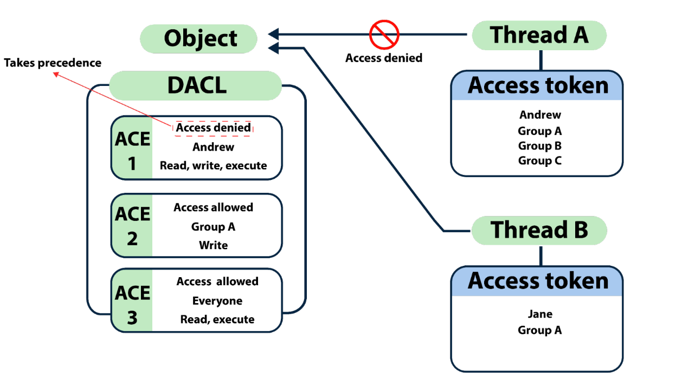

# ACLs

### **Access Control Model (ACM)**

* Consente il controllo sulla capacità di un processo di accedere a oggetti e altre\
  risorse in Active Directory in base a:
  * Access Tokens (security context di un processo - identita' e priviliegi dell'utente)
  * Security Descriptors (SID del proprietario, Discretionary ACL (DACL) and\
    System ACL (SACL))

### **Access Control List (ACL)**

* Si tratta di un elenco di Access Control Entries (ACE) -&#x20;
* Un ACE corrisponde a singole autorizzazioni o controlli di accesso. (es. Chi ha l'autorizzazione e cosa può essere fatto su un oggetto?)
* Due tipologie
  * DACL - Definisce i permessi in termini di Trust (da parte di un utente o un gruppo) su un oggetto
  * SACL - Mantengono, tramite messaggi di log, informazioni relative l'accesso sull'oggetto, sia in caso di successo (accesso) che di fallimento (accesso negato)&#x20;
* Le ACL sono vitali per la architettura di sicurezza delle soluzioni AD

<figure><figcaption></figcaption></figure>

* Ottenere le ACL associata ad uno specifico oggetto

```powershell
Get-DomainObjectAcl -SamAccountName student1 -ResolveGUIDs
```

* Ottenere le ACL associata ad uno specifico prefisso utilizzato per la ricerca

```powershell
Get-DomainObjectAcl -SearchBase "LDAP://CN=Domain
Admins,CN=Users,DC=dollarcorp,DC=moneycorp,DC=local" -ResolveGUIDs -Verbose
```

* Enumerare le ACL utilizzando il modulo AD ma senza risolvere i GUIDs

```powershell
(Get-Acl'AD:\CN=Administrator,CN=Users,DC=dollarcorp,DC=moneycorp,DC=local').Access
```

* RIcerca di ACEs interessanti

```powershell
Find-InterestingDomainAcl -ResolveGUIDs
```

* Ottenere ACL associate per uno specifico path

```powershell
Get-PathAcl -Path "\\dcorp-dc.dollarcorp.moneycorp.local\sysvol"
```
