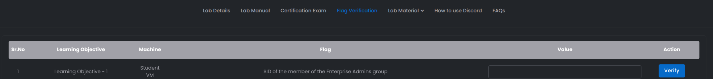

# LEARNING OBJECTIVE 1

<div data-full-width="true"><figure><figcaption></figcaption></figure></div>

* Enumerate following for the dollarcorp domain:
  * &#x20;Users
  * Computers
  * Domain Administrators
  * &#x20;Enterprise Administrators


• Use BloodHound to identify the shortest path to Domain Admins in the\
dollarcorp domain.

\
• Find a file share where studentx has Write permissions.

### SKILL ASSSESSMENT

Pre-requisites:

* Prima di eseguire qualsiasi cosa usare la Invi-Shell, selezionare il .bat in base ai privilegi, in questo caso essendo utenti di dominio non privliegiato utilizziamo _**RunWithRegistryNoAdmin.bat**_

```powershell
RunWithRegistryNonAdmin.bat
```

* Importare PowerView o ActiveDirectory Module

```powershell
. ..\PowerView.ps1
```

#### &#x20;1-Enumerazione Domain Users

* Ottieni tutti gli attributi per ogni utente del dominio, tuttavia risulta molto noisy come output

```powershell
Get-DomainUser
```

<figure><figcaption></figcaption></figure>

* Enumera tutt gli utenti del dominio, riportando in output un sottoinsieme degli attributi presenti, samaccountname e logoncount in questo caso

```powershell
 Get-DomainUser | Select samaccountname, logoncount
```

<figure><figcaption></figcaption></figure>

#### &#x20;2-Enumerazione Domain Computers

* Enumerazione degli host nel dominio

```powershell
Get-DomainComputer
```

<figure><figcaption></figcaption></figure>

* Enumerazione per hostname degli host presenti nel dominio

```powershell
Get-DomainComputer | Select name
```

<figure><figcaption></figcaption></figure>

#### 3-Enumerazione Domain Admins

* Enumerazione Domain Admins, step 1 enumerare tutti i gruppi

```powershell
Get-DomainGroup | select Name
```

<figure><figcaption></figcaption></figure>

* Enumerazione membri del gruppo Domain Admins

```powershell
 Get-DomainGroupMember -Identity "Domain Admins" -Recurse
```

<figure><figcaption></figcaption></figure>

#### 4-Enumerazione Enterprise Admins

* Enumerazione Enterprise Admins

Poiché non si tratta di un forest root domain , il comando sopra riportato non restituirà alcun risultato.&#x20;

```powershell
 Get-DomainGroupMember -Identity "Enterprise Admins" -Recurse"
```

<div data-full-width="true"><figure><figcaption></figcaption></figure></div>

È necessario interrogare il Domain Controller poiché il gruppo Enterprise Admins è presente solo nella Forest Root.


```powershell
 Get-DomainGroupMember -Identity "Enterprise Admins" -Domain moneycorp.local -Recurse
```


<figure><figcaption></figcaption></figure>

#### &#x20;Utilizza BloodHound per identificare lo shortest path per il Domain Admin nel domino dollarcorp

* Installazione e attivazione neo4j

DA RIFARE UNA VOLTA ADMIN

### FLAG: S-1-5-21-335606122-960912869-3279953914-500 (SID Enterprise Admin Member)
