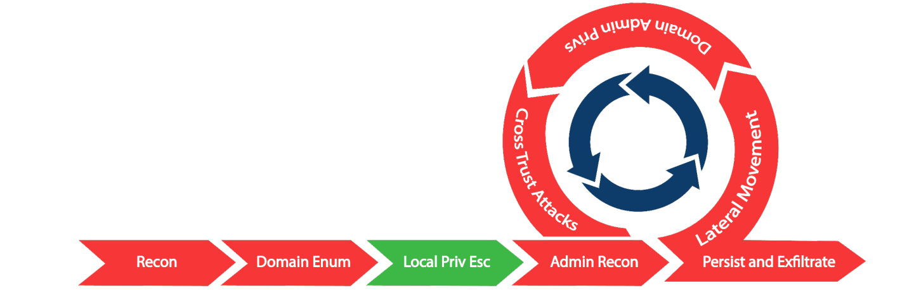

# Privilege Escalation-General

* In un ambiente AD, ci sono scenari multipli che possono portare ad una Privilege Escalation, nello specifico nel lab utilizzeremo i seguenti Attack-Path
  * Hunting for Local Admin access on other machines
  * Hunting for high privilege domain accounts (like a Domain Administrator)
* Inoltre anche Attack Patch che coinvologno Local Privilege Escalation

<figure><figcaption></figcaption></figure>

